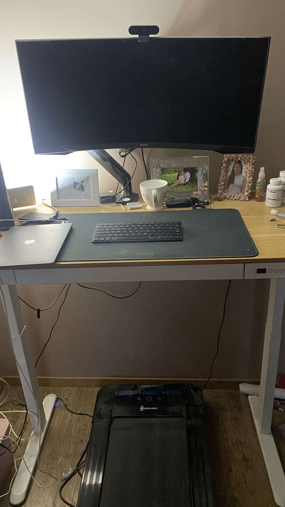
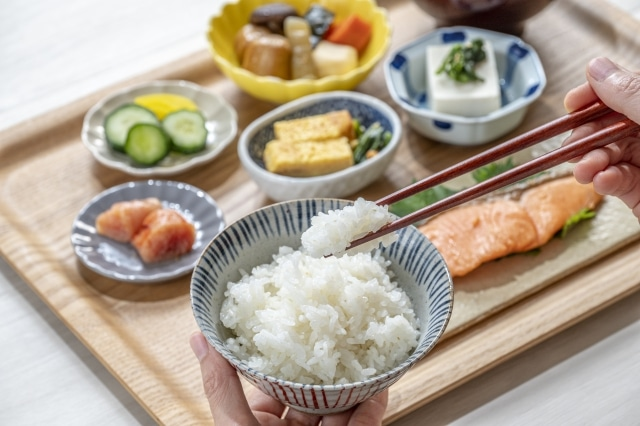
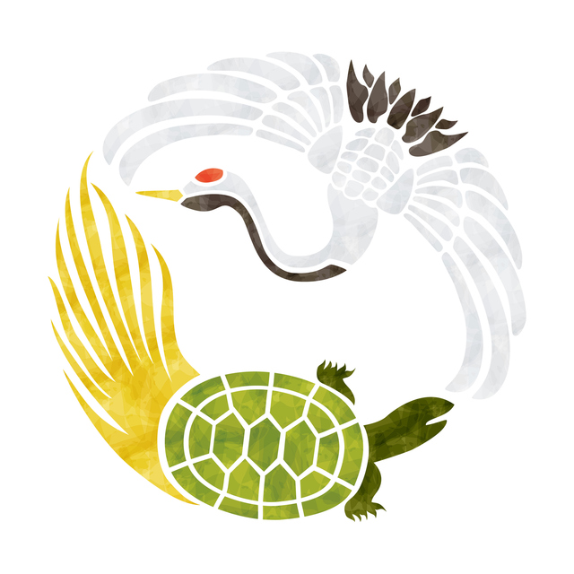

# こんにちは!

## Stay fit 💪 Code better 🧑‍💻
Presenter: **Csaba Tamas**

> A Sportsman’s Practical Tips for JavaScript Developers

<!--
こんにちは, (ko-n-ni-csi-va) everyone! Thank you for joining me today and give me your 10 minutes attention.
My name is Csaba Tamas and I would like to share my real life practical tips
to help you stay fit and code better.

 -->

---

## About me 🧔🏻‍♂️
👨‍💻 Frontend Architect

🅰️ Angular contributor

🏋️‍♀️Powerlifter competitor


<!--
Let me quickly introduce myself.
👨‍💻 I’m a frontend architect from Hungary 🇭🇺 mostly I working with angular projects, I used lot of web based technoligies, like webcrypto or webassambly..., but today I don't want to talk about tis becouse, 🏋️‍♀️ Outside of coding, I’ve been actively involved in competitive powerlifting and natual bodybuilding.

If you don't know powerlifting is the combination of the main bodybuilding excercises. (squat, deadlift and benchpress).

I can tell I have quite good competition results.
I rank around the middle of the hungarian leaderboard, with 500kg total.

So basicly I’m really passionate about any health related topic. I could talk about it for hours.
-->

---

# Why ligthning talk? ⚡️

- It is a JavaScript conference, this topic is not so related to JS world. I hope that you will find them useful and you will be able inlcude some tips to your daly routine
- This is a beginner-level presentation, so I won't be diving into complex topics like circadian rhythms or other deep details.
- I try to collect lot if interesting information and studies to give you the most of the takeaways what I can
- I tried to add the maxium amount of developer content to it (follow dark slides).

<!--
But today it is "only" lightning talk, but why?
Because this is a JavaScript conference, and I know not all of you are interested about fitness, but I hope you can benefit from them and inlcude some tips to your daly routine.

This is a beginner-level presentation, so I won't be diving into complex topics like circadian rhythms or other deep details.

I’ve tried to collect lot of interesting statistics and information.

I would like to share my own experiances, how I was able to improve my life with some small changes.

My goal is to give you as many takeaways as I can,
if you are interedted only JS just follow the dark slides.
-->

---
<!-- _class: invert -->

# Slides 🎞️
- **Marp**: markdown presentation ecosystem from **Yuki Hattori** 🇯🇵
- It is a powerful TypesSript based framework, that enables you to create stunning slides effortlessly.
- You can download my slides fjust scan the QR code


<!--

By the way, these slides are made with Marp, a TypeScript-based framework created by Japanese developer Yuki Hattori.

You can download these slides just scan the QR code.
-->

---

# Let's start with my favorite topic: STRENGTH 🏋️‍♀️
> The average grip strength of **women** from the **1970s** is comparable to that of **teeneager boys today**.

> In the 2020 [study](https://pmc.ncbi.nlm.nih.gov/articles/PMC7877981/) shows the people with lower grip strength were more likely (20%) to die of any cause compared to people with higher grip strength.

#### But why it is important? 💪
- It isn't just important for daily tasks (carry groceries, lift objects etc..).
- Strength helps you to live a better quality life. Everything became easier.
- It reduces the risk of injuries, by improving your balance and stability.
- More strength equals more muscle which helps you in the weight management
- **Reduce mortality**.

<!--
Let’s start with my favorite topic strength.

Did you know the grip strength of today’s average teenagers is weaker than that of women in the 1970s?

So we became weaker and weaker time by time.
But what is the problem why it is so important:

A 2020 study found that people with lower strength were 20% more likely to die prematurely.
Strength improves balance, reduces injuries.
Strength helps you to live a better quality life.

So overall everything became easier and you will be able to enjoy more your old ages.

 -->

---
# How can we improve our strength? 🏋️‍♀️

First advice: **Just lift weights.**


<!-- _footer: Japan’s hidden strength culture you didn’t know of - Chikara Ishi 力石 https://www.youtube.com/watch?v=3CEjK9haKSQ -->

<!--
My advice? Just lift weights.
It doesn’t have to be heavy; consistency is key. You can even start with bodyweight exercises or resistance bands.
It is not necesary to go the the gym you know one of the acciant sport is the traditional japanese stone lifting.

 -->

---


Adjustable kettlebell
From: 3,4-18kg

<!-- If you’re looking for a simple tool to get started, try adjustable kettlebells. They’re compact, and perfect for a quick home workout. As developers, efficiency matters, and this is the Swiss Army knife of fitness equipment, you can reach the maximum performance what you need.

So lets grip a kettlebell and write a JavaScript for this!

 -->

---
<!-- _class: invert -->
## Did you know how it is possible to estimate your maximum performance with JavaScript
```javascript
const weight = 100; // Used weight in kg
const reps = 5; // Repetitions

function calculate1RM(weight, reps) {
  return {
    epley: weight * (1 + reps / 30),
    brzycki: weight * (36 / (37 - reps)),
    mcglothin: weight * (100 / (101.3 - 2.67123 * reps)),
    lombardi: weight * Math.pow(reps, 0.10),
    mayhew: (100 * weight) / (52.2 + 41.9 * Math.exp(-0.055 * reps))
  }
}

console.log(calculate1RM(weight, reps));
/*
{
  epley : 116.66666666666667,
  brzycki: 112.5,
  mcglothin: 113.70891767872342,
  lombardi: 117.4618943088019,
  mayhew : 119.01068045151959
}
/*
```

<!--

Let's use our most important muscle which is our brain.

I prefer the first epley method it is quite good for benchpresses.

As you can see I live in the browsers, right? Let's see what's outside of it..

-->

---

# Perfect workstation for perfect performance 💪

> Office workers with proper ergonomic setups report a 15% reduction in pain and a 12% productivity boost -> [PubMed Central](https://pmc.ncbi.nlm.nih.gov/articles/PMC8010160/).

> Poor posture leads to back and neck pain, affecting 50% of tech workers -> [American Chiropractic Association](https://www.acatoday.org/news-publications/trending-in-the-media-and-at-home-musculoskeletal-pain/).

> 70% of tech workers experience computer vision syndrome -> [American Optometric Association](https://www.aoa.org/about-the-aoa/press-room/press-releases/most-americans-experience-digital-eye-strain-from-overexposure-to-computers-according-to-survey).

> Regular movement boosts **creativity** by 81% -> [Stanford University, 2014](https://news.stanford.edu/stories/2014/04/walking-vs-sitting-042414).



<!--
The right side this is my workstation. As you can see I using a standing table with a walking pad.
It is really important to setup the proper desk and monitor height of the to make it comfortable.

Sunlight lamp is also affects your mood, therefore your performance.

The best if the monitor center is front of you eyes and you can lie your fingers to the keyboard (90 degree angle)

Lets talk about an other important thing

 -->

---

#  How much is the ideal breaks? ⏰
 Ideal break :
  - For eyes: Every 20 minutes you should have a break and for 20 secounds 20 meter away, like looking out of the window
  - Take a 5-10 minute break every hour to stretch, walk around, hydrate, or simply relax your mind.

 Use break reminder apps like:
 -  Time Out, Breaktimer,  Pandan, Zenbreak, Breather, TotalPause or Stretchly

**Small, consistent breaks = Better performance!**

<!--
Screen time takes a toll on your eyes. 70% of tech workers experience symptoms of Computer Vision Syndrome, including headaches and dry eyes.

 Use break reminder apps like Time Out or Stretchly. The 20-20-20 rule works wonders: Every 20 minutes, look 20 meters away for 20 seconds. For overall health, take a 5-10 minute break every hour.
-->

---
<!-- _class: invert -->
# How to use Notification API
```javascript
Notification.requestPermission();

function showNotification(title, body) {
  if (Notification.permission === "granted") {
    new Notification(title, { body });
  }
}

// Notify for eye break every 20 minutes
setInterval(() => {
  showNotification(
    "Eye Break Reminder",
    "Time for a 20-second eye break! Look away from your screen."
  );
}, 20 * 60 * 1000);

// Notify for rest every hour
setInterval(() => {
  showNotification(
    "Get Up and Rest",
    "It's time to get up and take a 5-10 minute rest!"
  );
}, 60 * 60 * 1000);
```

<!--  and let's move on and talk about the the unsung hero of productivity. -->

---

# The power of deep sleep. 🚀

> Sleep deprivation affects memory, focus, and productivity. One sleepless night reduces cognitive performance by up to 30% -> [Nature](https://www.nature.com/articles/s41598-021-00188-8).

> Developers sleeping 7–8 hours are 29% more productive than those with less than 6 hours -> [Sleep Foundation](https://www.sleepfoundation.org/sleep-hygiene/good-sleep-and-job-performance).

### Track and optimize sleep patterns
I can tell athletes need 8–9 hours per night for optimal recovery.
Developers benefit similarly for focus and creativity, but not only the quantity is important.
It is really important to take time in deep sleep (stage 3) without disturb it.

<!--
Personaly I need 8–9 hours of sleep for recovery.
Deep sleep, in particular, helps consolidate memory and repair the body. Skipping it reduces cognitive performance by up to 30%.

Use apps like SleepCycle to track your sleep. Prioritize quality over quantity to wake up refreshed and focused.

And what whas the biggest improvment related to my sleep.
 -->

---

# How can I improve my sleep quality? 📈
Do not use the default alarm clock. Instead use **SleepCycle**  or any other app to track and analyze sleep data.

<!-- Almostour last topic, but it is part of all the healt related presentaion -->

---
# Food 🍜
> The Japanese diet is linked to a 15% lower risk of early death compared to Western diets -> [BMJ, 2016](https://www.bmj.com/content/352/bmj.i1209).


<br>
<br>

**Just eat your traditional meals.**



<!--
The Japanese diet is a global benchmark for health.

My advice? Stick to nutrient-dense, whole foods. If possible, incorporate elements of the Japanese diet into your routine.
 -->

---

# But let's take a look at one of the biggest health issues in Japan 🇯🇵
## Overwork and Burnout 🔥

> In the tech industry in Japan, 57% of developers report working more than 8 hours daily, leading to burnout -> [Stack Overflow Developer Survey](https://survey.stackoverflow.co/2024/).

> Burnout rates among developers have increased by 18% in the last five years -> [Gallup Workplace Study, 2023](https://www.gallup.com/workplace/349484/state-of-the-global-workplace.aspx).

> Overwork increases the risk of depression by 60% -> [Journal of Occupational Health](https://pmc.ncbi.nlm.nih.gov/articles/PMC6617405/).

<!--
Japan’s culture of overwork has led to burnout becoming a significant issue. 57% of developers here work more than 8 hours a day, and burnout rates have increased.

Too much work causes burnout, reducing performance and productivity.

-->
---

### My final takeaway: 🤗
# Life is like to squat, find tha balance in your life.

<!--
Here’s my final takeaway: Life is like a squat—it’s about balance. Balancing mobility and stability is key in both sports and life. Similarly, balancing work and health leads to sustainable success.
-->

---

# Thank you very much!

ありがとう ございます

# 🙋🏻‍♀️ Questions? 🙋🏻



<!--

Árigatō Gozájmász

Thank you all for listening! I’m happy to answer any questions you have.
-->