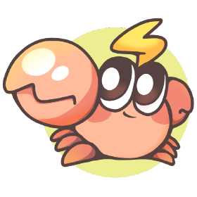
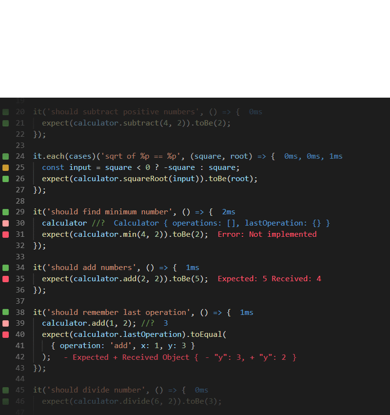

# こんにちは。

## Stay fit 💪 Code better 🧑‍💻
Presenter: **Csaba Tamas**

>  A sportsman’s real life practical advices for JavaScript Developers

<!--
こんにちは, everyone! Thank you for joining me today. My name is Csaba Tamas, and I’m here to share insights from two seemingly unrelated worlds—software development and competitive sports.

Today, I’ll share 10 practical, sports-inspired health tips to help you stay fit and code better. And don’t worry—I’ve included some JavaScript magic to make it relatable for all of us!
 -->

---

## About me 🧔🏻‍♂️
👨‍💻 Frontend Architect

🅰️ Angular contributor

🏋️‍♀️Powerlifter competitor


<!--
Let me quickly introduce myself.
👨‍💻 I’m a frontend architect from Hungary 🇭🇺 with nore than 10 years of experience, mostly I worked with angular projects, this is reason why I was able to contribute to the angular source code, but nowdays I mostly work with react based technoligies.
🏋️‍♀️ Outside of coding, I’ve been actively involved in competitive powerlifting. I rank around the middle of the leaderboard, with a total lift just over 500kg.

I’m really passionate about sports and all things related to health. I could talk about them for hours!
-->

---

# Why ligthning talk? ⚡️

- It is a JavaScript conference, this topic is not so related to JS world, but I tried to put the maxium amount of programer content to it (dark slides).
- I can talk about this topic for hours, but short talks are more likely to keep the audience's attention from start to finish.
- I try to give you the most of the takeaways what I can

<!--
But today it is Lightning talk, but why?
Because this is a JavaScript conference, and I know not all of you are interested in the topic. But I’ve tried to collect  lot of interesting statistics and information (I spent two days collecting only the studies!). My goal is to give you as many takeaways as I can, if you are interedted only JS just
dark slides.
-->

---
# Japan and Hungary language in common


<!--

Fun fact: Japanese and Hungarian languages share some structural similarities. For example, we both use family name first, followed by the given name—so, Tanaka Hiroshi instead of Hiroshi Tanaka, or Kovács István instead of István Kovács.

Another shared trait is how we format dates. Both Japan and Hungary use the year-month-day syntax, like 2024-11-17, which aligns with ISO standards. It’s a small, practical detail but reflects an organized and logical approach shared by both cultures.

-->

---
<!-- _class: invert -->

# Slides
- **Marp**: markdown presentation ecosystem from **Yuki Hattori** 🇯🇵
- It is a powerful TypesSript based framework, that enables you to create stunning slides effortlessly.
- You can download the my slides from  [JSConf.JP](https://jsconf.jp)


<!--

By the way, these slides are made with Marp, a TypeScript-based framework created by Japanese developer Yuki Hattori.

You can download these slides later from JSConf.JP.
-->

---

# Let's start with my favorite topic STRENGTH
> The average grip strength of **women** from the **1970s** is comparable to that of **teeneager boys today**.

> In the 2020 [study](https://pmc.ncbi.nlm.nih.gov/articles/PMC7877981/) shows the people with lower grip strength were more likely (20%) to die of any cause compared to people with higher grip strength.

#### But why it is important? 💪
- It isn't just important for daily tasks (carry groceries, lift objects etc..).
- Strength helps you to live a better quality life. Everything became easier.
- It reduces the risk of injuries, by improving your balance and stability.
- More strength more muscle helping which help you in the weight management
- **Reduce mortality**.

<!--
Let’s start with my favorite topic strength.
Did you know the grip strength of today’s average teenagers is weaker than that of women in the 1970s? Grip strength isn’t just a gym stat—it’s a marker of longevity.

A 2020 study found that people with lower grip strength were 20% more likely to die prematurely. Why? Strength improves balance, reduces injuries, and supports better health overall.

Improving grip strength helps provide better support for your wrists and hands, reducing the risk of injuries. After all, your fingers are the tools you use to write code.

 -->

---
# How we can improve our strength?

First advice: **Just lift weights.**


<!-- _footer: Japan’s hidden strength culture you didn’t know of - Chikara Ishi 力石 https://www.youtube.com/watch?v=3CEjK9haKSQ -->

<!--
My advice? Just lift weights.
It doesn’t have to be heavy; consistency is key. You can even start with bodyweight exercises or resistance bands. The idea is to gradually challenge your muscles.
 -->

---


Adjustable kettlebell
From: 3,4-18kg

<!-- If you’re looking for a simple tool to get started, try adjustable kettlebells. They’re compact, versatile, and perfect for a quick home workout. As developers, efficiency matters, and this is the Swiss Army knife of fitness equipment, you can reach the maximum performance what you need. -->

---
<!-- _class: invert -->
# Speed up the build with RSPack and Farmfe 🚀
<br><br><br><br><br><br><br><br><br><br><br><br><br>




<!--
I started to talk about tools it is a good place to show you RSPack and Farmfe, two exciting tools from the JavaScript ecosystem RSPack is a Rust based replacement of webpack and farmfe is rust based replacement of vite
-->

---

# Sitting is a natural positon, but...
> - **Study**: Poor posture leads to back and neck pain, affecting 50% of tech workers (*American Chiropractic Association*).
> - **Statistic**: Office workers with proper ergonomic setups report a 15% reduction in pain and a 12% productivity boost (*HBR*).

so the wrong sitting is the problem, but if you do in ergonomic setups and get up frequently it is not a health issue.

<!--
Sitting itself isn’t harmful—it’s how you sit that makes the difference. Poor posture leads to back and neck pain, affecting 50% of tech workers.

Invest in an ergonomic setup. A well-designed chair, proper desk height, and frequent breaks reduce pain by 15% and improve productivity by 12%. Remember, posture affects not just your comfort but also your focus and efficiency.
 -->

---

# Sitting and mens health 🍆

- Research shows that prolonged sitting increases scrotal temperature by 2-3°C, impairing sperm production as the testes struggle to maintain the ideal temperature of about 34°C.

- Physically active men had 46% higher sperm concentration and 44% more total sperm compared to sedentary men, based on a study of 377 participants.

- A study published in Human Reproduction noted that Ssperm concentration declined by 42% between 2000 and 2017 in men seeking fertility treatment, with sedentary lifestyles and heat exposure as major contributors.

<!--
Did you know prolonged sitting increases scrotal temperature, impairing sperm production? Physically active men have significantly better reproductive health. This isn’t just about fertility—it’s about maintaining overall body function.

If you can’t stand up every hour, walk when possible, or integrate movement into your routine. Even small adjustments make a big impact.
-->

---

# What I do if I am not able to wake up in every hour?
 Two tips in one: **If you are too focused, stay and if you can walk to improve daly activity.**

---

# Protect your vision
>  70% of tech workers experience computer vision syndrome (*American Optometric Association*).

##  What can I do the take ideal breaks?
 4th advice: Use break reminder apps like:
 -  Time Out, Breaktimer,  Pandan, Zenbreak, Breather, TotalPause or Stretchly

 Ideal break :
  - For eyes: Every 20 secound break every 20 minutes look 20m away
  - For every other aspect: 5-10 minutes in every hours

<!--
Screen time takes a toll on your eyes. 70% of tech workers experience symptoms of Computer Vision Syndrome, including headaches and dry eyes.

Here’s my 4th tip: Use break reminder apps like Time Out or Stretchly. The 20-20-20 rule works wonders: Every 20 minutes, look 20 meters away for 20 seconds. For overall health, take a 5-10 minute break every hour.
-->

---
<!-- _class: invert -->
# How to use Notification API
```javascript
Notification.requestPermission();

function showNotification(title, body) {
  if (Notification.permission === "granted") {
    new Notification(title, { body });
  }
}

// Notify for eye break every 20 minutes
setInterval(() => {
  showNotification(
    "Eye Break Reminder",
    "Time for a 20-second eye break! Look away from your screen."
  );
}, 20 * 60 * 1000);

// Notify for rest every hour
setInterval(() => {
  showNotification(
    "Get Up and Rest",
    "It's time to get up and take a 5-10 minute rest!"
  );
}, 60 * 60 * 1000);
```

---

# The Power of deep sleep. 🚀

> Sleep deprivation affects memory, focus, and productivity. One sleepless night reduces cognitive performance by up to 30% (*Nature*).

> Developers sleeping 7–8 hours are 29% more productive than those with less than 6 hours (*Sleep Foundation*).

### Track and optimize sleep patterns
Athletes need 8–10 hours per night for optimal recovery. Developers benefit similarly for focus and creativity, but not only the quantity is important.
It is really important to take time in Deep sleep (Stage 3) and not to stop it.

<!--
Sleep is the unsung hero of productivity. Athletes need 8–10 hours of sleep for recovery, and developers benefit similarly.
Deep sleep, in particular, helps consolidate memory and repair the body. Skipping it reduces cognitive performance by up to 30%.

Use apps like SleepCycle to track your sleep. Prioritize quality over quantity to wake up refreshed and focused.
 -->

---

# How can I improve my sleep quality? (5th tip):
Do not use the default alarm clock use **SleepCycle** or any other app to track and analyze sleep data.

---
<!-- _class: invert -->
## Wallaby Immediate test feedback in your IDE as-you-type
<br><br><br><br><br><br><br><br><br><br><br>



<!--
Let’s talk about testing efficiency. Wallaby.js is a game-changer for developers because it provides real-time feedback on your tests directly in your IDE.

As you write or modify code, Wallaby instantly highlights which tests pass or fail—no need to switch contexts or run your test suite manually. It’s like having a coach constantly analyzing your form and providing corrections on the spot.
-->

---

# Let's take a look one of the biggest health issue in Japan
## Overwork and Burnout

> In the tech industry in Japan, 57% of developers report working more than 8 hours daily, leading to burnout (*Stack Overflow Developer Survey*).

> Burnout rates among developers have increased by 18% in the last five years (*Gallup Workplace Study, 2023*).

> Overwork increases the risk of depression by 60% (*Journal of Occupational Health*).

<!--
Japan’s culture of overwork has led to burnout becoming a significant issue. 57% of developers here work more than 8 hours a day, and burnout rates have increased by 18% in five years.

How do we tackle this? Sports teach us to:

Set clear goals: Prioritize what matters.
Maintain consistency: Sustainable habits beat sporadic sprints.
Value recovery: Rest isn’t optional—it’s essential.
Work as a team: Share the workload and support each other.
-->

---

## How Sports Mentality solves this (6th advice collection):
1. **Set clear goals**: Like athletes, prioritize measurable daily goals and set boundaries for work hours.
2. **Consistency, not intensity**: Sustainable habits beat all-nighters. Use structured techniques like Pomodoro.
3. **Prioritize recovery**: Athletes invest in rest. Developers should too, using tools like **Calm** for mental recovery.
4. **Collaborate like a team**: Share the workload to avoid burnout and foster a supportive environment.
5. **Think long-term**: Olympians train for years; developers should focus on sustainable career growth.

---

# Loneliness kill you
>  Japan ranks among the highest for reported loneliness, with 15% of adults feeling socially isolated (*NHK Survey, 2023*).

>  Loneliness is as damaging to health as smoking **15 cigarettes** a day (*Cigna Study, 2018*).

>  Developers working remotely or in isolated environments report higher rates of loneliness, per a *GitHub* survey (2022).

## Practical Tips (7th):
  - Engage in local tech meetups or coding boot camps.
  - Collaborate on open-source projects to foster connections.
  - Find local groups for developers or fitness enthusiasts.


<!--
Loneliness is a hidden epidemic, especially in Japan, where 15% of adults feel socially isolated. Research equates its health impact to smoking 15 cigarettes a day.

For developers, isolation worsened during remote work. My advice? Engage in meetups, open-source projects, or fitness groups to build connections. A strong network improves both mental and professional well-being.
-->

---

### Another Key Takeaway (8th advice):
Not the count of the connections metters.


<!-- _footer: Robert Waldinger: What makes a good life? Lessons from the longest study on happiness: https://www.youtube.com/watch?v=8KkKuTCFvzI -->

---
# Food
> The Japanese diet is linked to a 15% lower risk of early death compared to Western diets (*BMJ, 2016*).

> Japan has one of the highest life expectancies globally (85 years) due to its nutrient-rich traditional meals (*WHO, 2023*).

<br>

9th advice: **Just eat your traditional meals.**


<!--
The Japanese diet is a global benchmark for health. Rich in fish, vegetables, and fermented foods, it’s linked to a 15% lower risk of early death.

My advice? Stick to nutrient-dense, whole foods. If possible, incorporate elements of the Japanese diet into your routine.
 -->

---

### My final takeaway (10th advice):
# Life is like to squat, harmony between mobility and stability

<!--
Here’s my final takeaway: Life is like a squat—it’s about balance. Balancing mobility and stability is key in both sports and life. Similarly, balancing work and health leads to sustainable success.
-->

---

# Thank you very much!

ありがとう ございます

# 🙋🏻‍♀️ Questions? 🙋🏻


<!--
Thank you all for listening! Remember, taking care of your health isn’t just a personal investment—it’s a professional one too. I’m happy to answer any questions you have.
-->