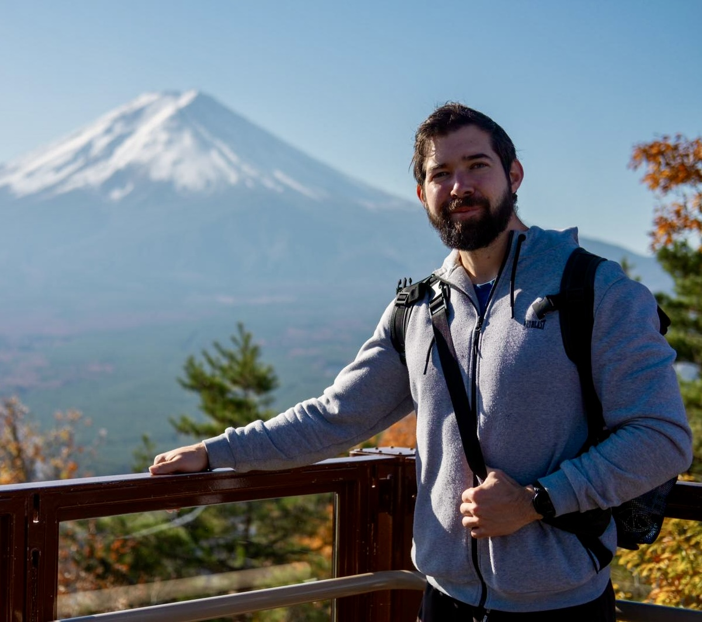
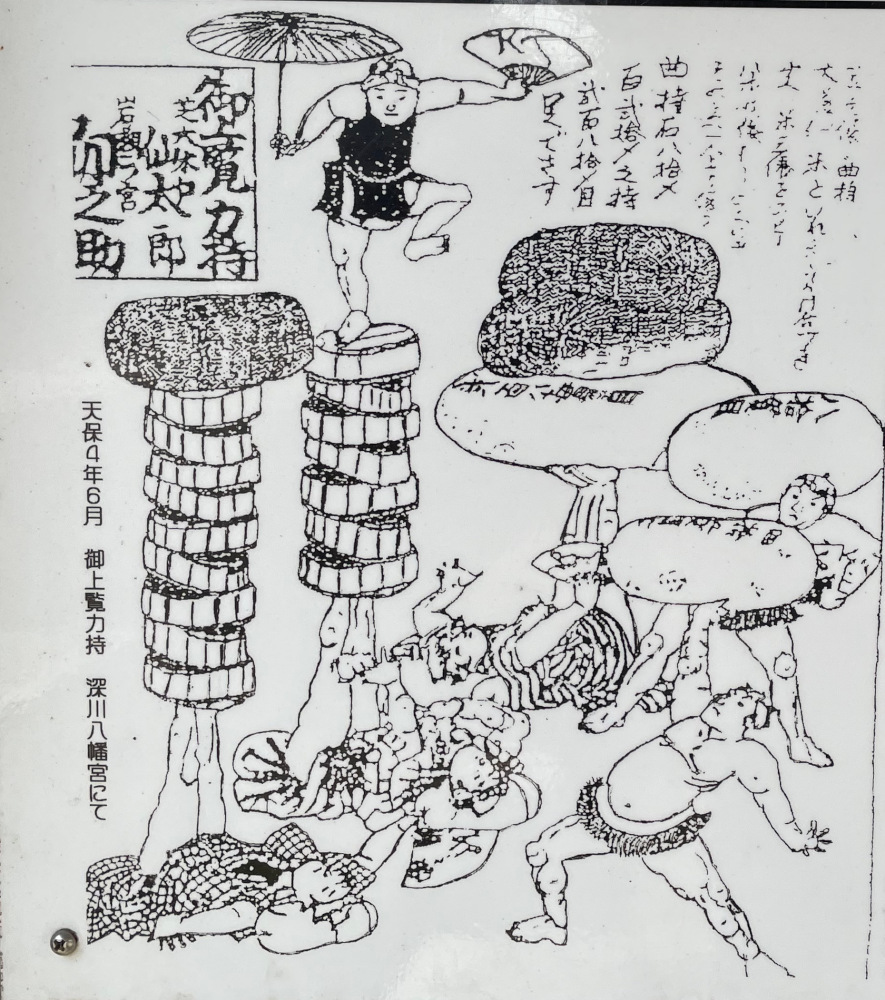
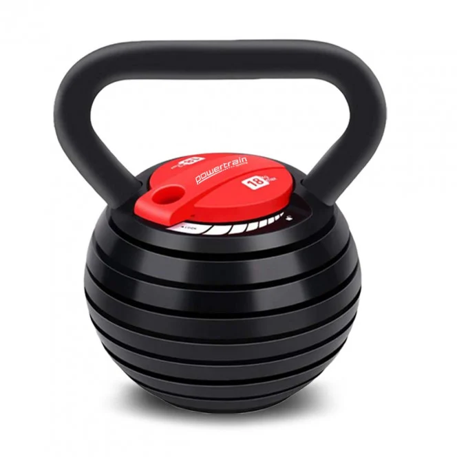
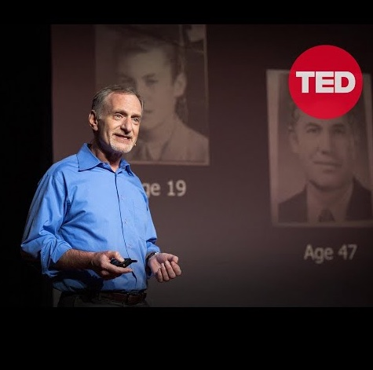

# こんにちは。

## Stay fit 💪 Code better 🧑‍💻
Presenter: **Csaba Tamas**

>  A sportsman’s real life practical advices for JavaScript Developers

---

## About me 🧔🏻‍♂️
👨‍💻 Frontend Architect

🅰️ Angular contributor

🏋️‍♀️Powerlifter competitor



---

# Why ligthning talk? ⚡️

- It is a JavaScript conference, this topic is not so related to JS world, but I tried to put the maxium amount of programer content to it (dark slides).
- I can talk about this topic for hours, but short talks are more likely to keep the audience's attention from start to finish.
- Lightning talks are like a power workout, brief but impactful.
- I try to give you the most of the takeaways what I can

---
# Japan and Hungary language in common


---
<!-- _class: invert -->

# Slides
- **Marp**: markdown presentation ecosystem from **Yuki Hattori** 🇯🇵
- It is a powerful TypesSript based framework, that enables you to create stunning slides effortlessly.
- You can download the my slides from  [JSConf.JP](https://jsconf.jp)


---

# Let's start with my favorite topic STRENGTH
> The average grip strength of **women** from the **1970s** is comparable to that of **teeneager boys today**.

> In the 2020 [study](https://pmc.ncbi.nlm.nih.gov/articles/PMC7877981/) shows the people with lower grip strength were more likely (20%) to die of any cause compared to people with higher grip strength.

#### But why it is important? 💪
- It isn't just important for daily tasks (carry groceries, lift objects etc..).
- Strength helps you to live a better quality life. Everything became easier.
- It reduces the risk of injuries, by improving your balance and stability.
- More strength more muscle helping which help you in the weight management
- **Reduce mortality**.


---
# How we can improve our strength?

First advice: **Just lift weights.**



<!-- _footer: Japan’s hidden strength culture you didn’t know of - Chikara Ishi 力石 https://www.youtube.com/watch?v=3CEjK9haKSQ -->

---


Adjustable kettlebell
From: 3,4-18kg

<!-- Perfect for develop back muscles -->

---
<!-- _class: invert -->

Maybe good place for rsbuild and farmfe

---

# Sitting is a natural positon, but...
> - **Study**: Poor posture leads to back and neck pain, affecting 50% of tech workers (*American Chiropractic Association*).
> - **Statistic**: Office workers with proper ergonomic setups report a 15% reduction in pain and a 12% productivity boost (*HBR*).

so the wrong sitting is the problem, but if you do in ergonomic setups and get up frequently it is not a health issue.

---

# Sitting and mens health 🍆

- Research shows that prolonged sitting increases scrotal temperature by 2-3°C, impairing sperm production as the testes struggle to maintain the ideal temperature of about 34°C.

- Physically active men had 46% higher sperm concentration and 44% more total sperm compared to sedentary men, based on a study of 377 participants.

- A study published in Human Reproduction noted that Ssperm concentration declined by 42% between 2000 and 2017 in men seeking fertility treatment, with sedentary lifestyles and heat exposure as major contributors.

---

# What I do if I am not able to wake up in every hour?
 Two tips in one: **If you are too focused, stay and if you can walk to improve daly activity.**

---

# Protect your vision
>  70% of tech workers experience computer vision syndrome (*American Optometric Association*).

##  What can I do the take ideal breaks?
 4th advice: Use break reminder apps like:
 -  Time Out, Breaktimer,  Pandan, Zenbreak, Breather, TotalPause or Stretchly

 Ideal break :
  - For eyes: Every 20 secound break every 20 minutes look 20m away
  - For every other aspect: 5-10 minutes in every hours

---
<!-- _class: invert -->
# How to use Notification API
```javascript
Notification.requestPermission();

function showNotification(title, body) {
  if (Notification.permission === "granted") {
    new Notification(title, { body });
  }
}

// Notify for eye break every 20 minutes
setInterval(() => {
  showNotification(
    "Eye Break Reminder",
    "Time for a 20-second eye break! Look away from your screen."
  );
}, 20 * 60 * 1000);

// Notify for rest every hour
setInterval(() => {
  showNotification(
    "Get Up and Rest",
    "It's time to get up and take a 5-10 minute rest!"
  );
}, 60 * 60 * 1000);
```

---

# The Power of deep sleep. 🚀

> Sleep deprivation affects memory, focus, and productivity. One sleepless night reduces cognitive performance by up to 30% (*Nature*).

> Developers sleeping 7–8 hours are 29% more productive than those with less than 6 hours (*Sleep Foundation*).

### Track and optimize sleep patterns
Athletes need 8–10 hours per night for optimal recovery. Developers benefit similarly for focus and creativity, but not only the quantity is important.
It is really important to take time in Deep sleep (Stage 3) and not to stop it.

---

# How can I improve my sleep quality? (5th tip):
Do not use the default alarm clock use **SleepCycle** or any other app to track and analyze sleep data.

---

<!-- _class: invert -->

Maybe good place for wallabyjs

---

# Let's take a look one of the biggest health issue in Japan
## Overwork and Burnout

> In the tech industry in Japan, 57% of developers report working more than 8 hours daily, leading to burnout (*Stack Overflow Developer Survey*).

> Burnout rates among developers have increased by 18% in the last five years (*Gallup Workplace Study, 2023*).

> Overwork increases the risk of depression by 60% (*Journal of Occupational Health*).

---

## How Sports Mentality solves this (6th advice collection):
1. **Set clear goals**: Like athletes, prioritize measurable daily goals and set boundaries for work hours.
2. **Consistency, not intensity**: Sustainable habits beat all-nighters. Use structured techniques like Pomodoro.
3. **Prioritize recovery**: Athletes invest in rest. Developers should too, using tools like **Calm** for mental recovery.
4. **Collaborate like a team**: Share the workload to avoid burnout and foster a supportive environment.
5. **Think long-term**: Olympians train for years; developers should focus on sustainable career growth.

---

# Loneliness kill you
>  Japan ranks among the highest for reported loneliness, with 15% of adults feeling socially isolated (*NHK Survey, 2023*).

>  Loneliness is as damaging to health as smoking **15 cigarettes** a day (*Cigna Study, 2018*).

>  Developers working remotely or in isolated environments report higher rates of loneliness, per a *GitHub* survey (2022).

## Practical Tips (7th):
  - Engage in local tech meetups or coding boot camps.
  - Collaborate on open-source projects to foster connections.
  - Find local groups for developers or fitness enthusiasts.

---

### Another Key Takeaway (8th advice):
Not the count of the connections metters.



<!-- _footer: Robert Waldinger: What makes a good life? Lessons from the longest study on happiness: https://www.youtube.com/watch?v=8KkKuTCFvzI -->

---
# Food

WIP

---

### My final takeaway (10th advice):
# Life is like to squat, harmony between mobility and stability


---

# Thank you very much 🚄

ありがとう ございます

# 🙋🏻‍♀️ Questions? 🙋🏻